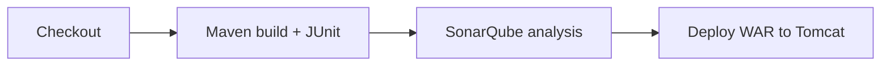

# Disney+ Hotstar UI Clone: Maven WAR for CI/CD Practice

A static streaming-site interface (JSP, CSS and JavaScript) packaged as a Maven WAR. It is a build target for CI/CD pipelines: Maven build, JUnit tests, SonarQube analysis and deployment to Apache Tomcat.

> Educational project. Not affiliated with or endorsed by Disney+ Hotstar; all titles and artwork belong to their respective owners.


## Repository structure

```text
pom.xml                                   WAR packaging, Java 8, sonar-maven-plugin
src/main/webapp/index.jsp                 Home page
src/main/webapp/assets/                   Styles, scripts (data.js holds the title cards) and images
src/main/webapp/WEB-INF/web.xml           Deployment descriptor
src/main/java/in/javahome/myweb/controller/Calculator.java       Sample class
src/test/java/in/javahome/myweb/controller/CalculatorTest.java   JUnit test run during the build
```

## Build and test

```bash
mvn clean package        # runs the tests and produces target/myapp.war
```

## Analyse with SonarQube

```bash
mvn sonar:sonar -Dsonar.host.url=http://<sonarqube-host>:9000 -Dsonar.login=<token>
```

## Deploy to Tomcat

Copy `target/myapp.war` into Tomcat's `webapps/` directory. The site is then served at `http://<host>:8080/myapp/`.

## Typical pipeline



## Credits

Based on [KastroVKiran/Hotstar-App](https://github.com/KastroVKiran/Hotstar-App) from Learn With Kastro's DevOps course.

---

<div align="center">
  <sub>Maintained by <a href="https://github.com/RajGenStack">Rajan Kumar</a> · <a href="https://www.linkedin.com/in/rajan-kumar42">LinkedIn</a></sub>
</div>
